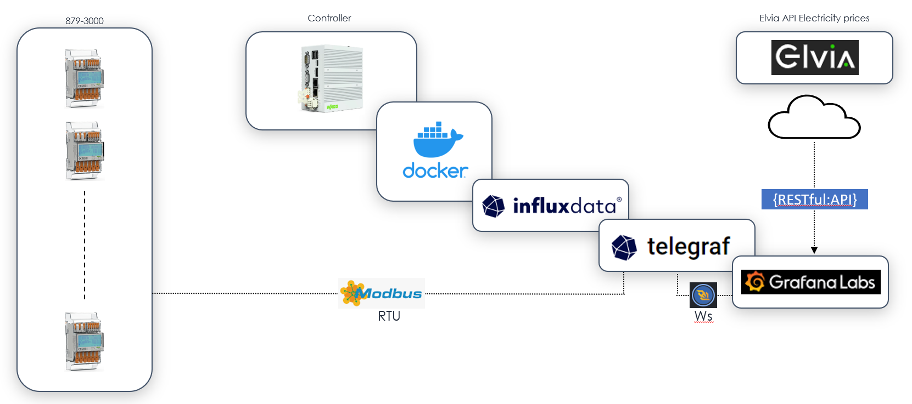

# README

Wago Energy Meters (MID 879-30xx) with TIG-stack (Telegraf+Influx+Grafana).

<figure><figcaption></figcaption></figure>

## 879-30xx Setup

Default password is 0000.

1. Download the Android app from store.
2. Enter the MID menu and select bluetooth.
3. Scan the QR-code.
4. Go to settings and change modbus settings according to telegraf configuration.

## Manually setup of TIG stack

### Prepare the controller

In WBM:

1. Set PLC Runtime to 'none'.
2. Enable 'IP Forwarding through multiple interfaces'.
3. Enable Docker.
4. Enable and set a NTP time server.
5. Format a memory card as 'ext4' with label 'Docker'.

Extend the docker data directory from internal flash to memory card. Change to “data-root”:“/media/docker”:

```
nano /etc/docker/daemon.json 
```

Permit docker to access serial port:

```
sudo chmod ugo+rw /dev/serial
```

Reboot the controller.

### Setup Telegraf

Get Telegraf from Dockerhub:

```
docker pull arm32v7/telegraf
```

Copy the script to '/home/admin' and make them executable:

```
chmod +x /home/admin/telegraf.conf
```

Create the container:

```
docker create --name telegraf --device=/dev/serial:/dev/serial:rw -v /home/admin/telegraf.conf:/etc/telegraf/telegraf.conf:ro arm32v7/telegraf:latest
```

### Setup Influx

Get Influx v1.8 from Dockerhub:

```
docker pull arm32v7/influxdb
```

Make a volume for data:

```
docker volume create influx-vol-data
```

Copy scripts to '/home/admin' and make them executable:

```
chmod +x /home/admin/influxdb.conf && chmod +x /home/admin/influxdb-init.iql
```

Create the container:

```
docker create --name influx -p 8086:8086 \
        -e INFLUXDB_ADMIN_USER=admin \
        -e INFLUXDB_ADMIN_PASSWORD=wago \
        -e INFLUXDB_MONITOR_STORE_ENABLED=FALSE \
        -v influx-vol-data:/var/lib/influxdb \
        -v /home/admin/influxdb.conf:/etc/influxdb/influxdb.conf \
        -v /home/admin/influxdb-init.iql:/docker-entrypoint-initdb.d/influxdb-init.iql \
        arm32v7/influxdb:latest -config /etc/influxdb/influxdb.conf
```

### Setup Grafana

Get Influx Grafana from Dockerhub:

```
docker pull grafana/grafana
```

Make a volume for data:

```
docker volume create grafana-vol-data
```

Create the container:

```
docker create --name grafana -p 3000:3000 -v grafana-vol-data:/var/lib/grafana grafana/grafana:latest
```

Default user is 'admin' and password 'wago123'.

There is an API key for Websockets live data present.

### Setup start conditions

Copy the provided script to '/etc/init.d' and make it executable:

```
chmod +x /etc/init.d/docker-tic-stack
```

Then make a symlink to this script in /'etc/init.d':

```
ln -s /etc/init.d/docker-tic-stack /etc/rc.d/S99_zz_docker_tic_Stack
```

### Run the stack

Repower the controller or execute 'reboot' command:

```
reboot
```

### Configure Grafana

Quickly get started with datasource for Influxdb:

1. Settings ->Add datasource -> InfluxDB
2. URL: [http://IPADDRESS:8086](http://10.0.0.228:8086)
3. Database: wagodb
4. User: admin
5. Password: wago123

Add token for Telegraf websocket data:

1. Settings -> API keys -> New API Key
2. Key Name: telegraf
3. Role: Admin
4. Time To Live: 1y


Import the Grafana dashboards.

##
